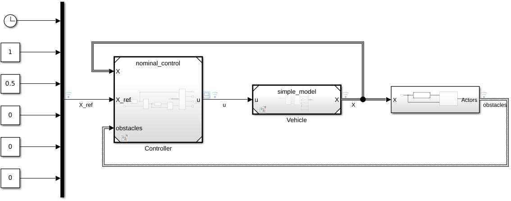
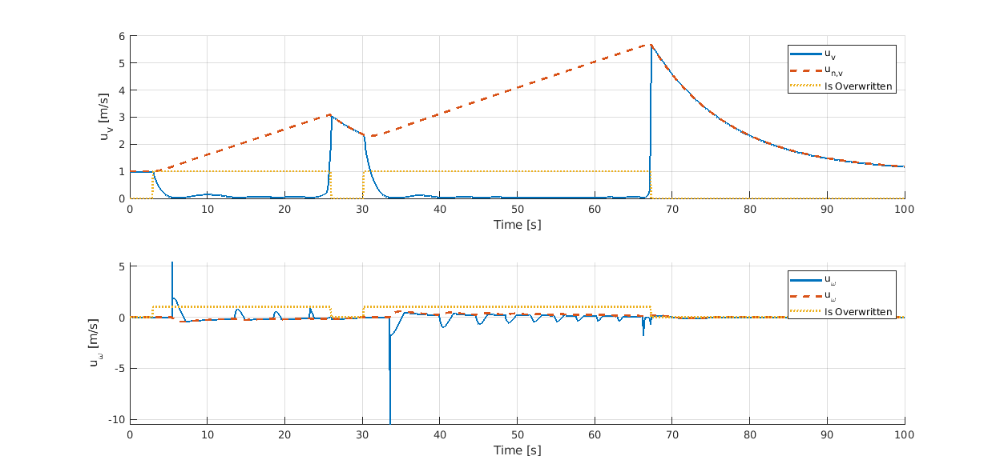
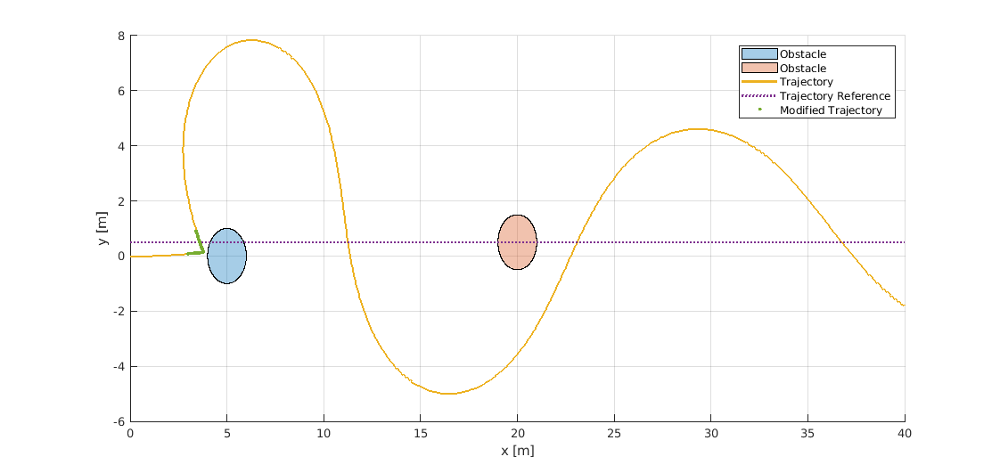
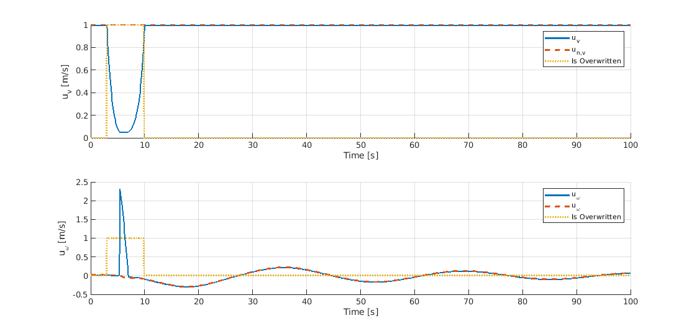

# CBF Differential Drive robot

## What is in repository
MATLAB/Simulink implementation of Control Barrier Function based of safety filter for mobile robot  with differential drive, described by equation:

to avoid circle obstacles.

For this purpouse following CBF was defined for each obstacle:

=(x_%7B1%7D-x_%7B1%7D%5E%7Bo%7D)%5E2&plus;(x_%7B2%7D-x_%7B2%7D%5E%7Bo%7D)%5E2&plus;x_%7B3%7D%5E%7B2%7D-(R&plus;r)%5E2%20)

## Implementation

## Results

### Trajectory Tracking

### Pure Pursuit

