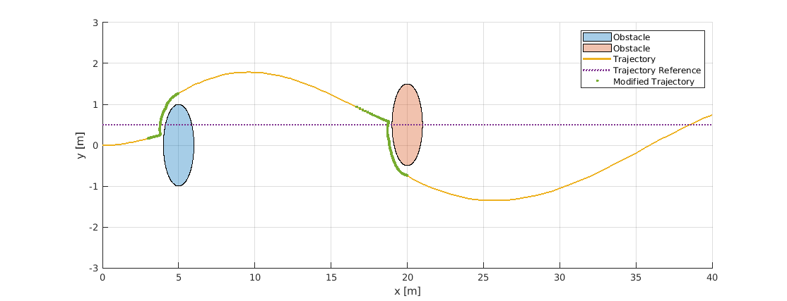

# CBF Differential Drive robot

## What is in repository
MATLAB/Simulink implementation of Control Barrier Function based of safety filter for mobile robot  with differential drive, described by equation:
$$
    \dot{x}
    =
    \begin{bmatrix}
        \cos{x_{3}} & 0\\
        \sin{x_{3}} & 0\\
        0           & 1
    \end{bmatrix}
    \begin{bmatrix}
        u_{v}\\
        u_{\omega}
    \end{bmatrix},
$$
to avoid circle obstacles.

For this purpouse following CBF was defined for each obstacle:
$$
    h_{i}(x) = (x_{1} - x_{1}^{o})^2 + (x_{2} - x_{2}^{o})^2 + x_{3}^{2} - (R + r)^2
$$

## Results

